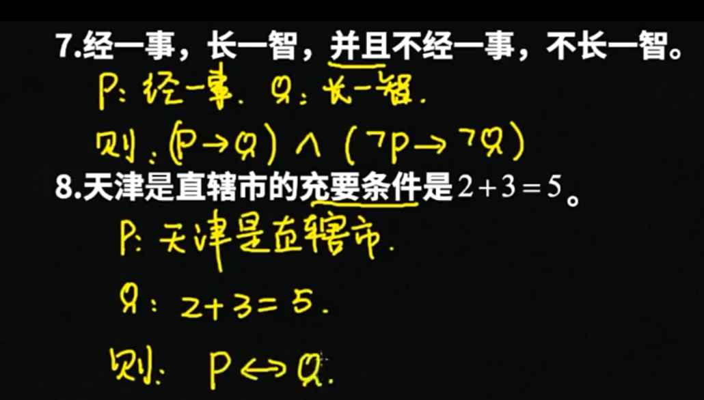
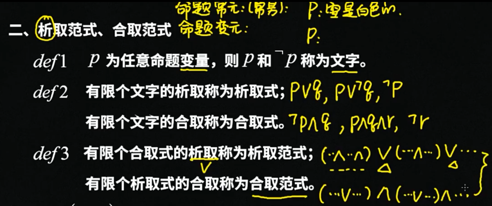
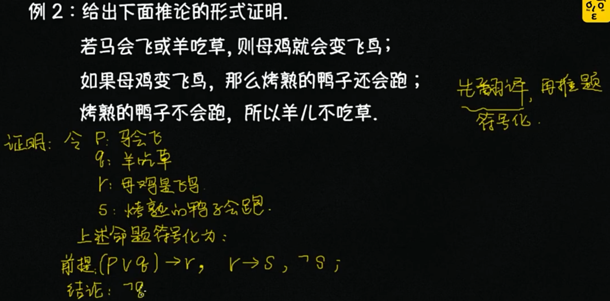

# 概念及定义

`驻点 стационарная точка` - 驻点就是这样的点, 函数在该处的偏微分全部为0，使用雅阁比矩阵的特征值可以衡量

`分岔` - 分岔就是从稳定过渡到不稳定的临界点。**分岔**（bifurcation）常出现在[动态系统](https://baike.baidu.com/item/动态系统)的数学研究中，是指系统参数（分岔参数）小而连续的变化，结果造成系统本质或是[拓扑结构](https://baike.baidu.com/item/拓扑结构)的突然改变。分岔会出现在连续系统（以常微分方程、时滞微分方程或偏微分方程来描述）或是离散系统中 （以映射来描述）。在几何观里面，**一个事物的状态，是相空间中的一个点，一个事物的变化，是相空间中点的移动，一个事物的变化过程过程，是相空间中的一条曲线。** 【简单定义】**分岔就是系统参数的变化引起了相空间的拓扑结构的变化，而此时参数点就叫做分岔点**。

`稳定性` - **对于一个动力系统的定态，对它施加一个微小的扰动，系统对这个扰动的响应为△（t），如果我们有随着时间的**

`稳定` - 稳定就是对误差不敏感

`不稳定` - 不稳定就是对微小扰动高度敏感

`混沌 chaos` - 微分方程的解对初值非常敏感

---

`微分方程` - 知道自变量、未知函数及函数的导数（或微分）组成的关系式，得到的便是微分方程，通过求解微分方程求出未知函数。微分方程模型的特点是反应客观现实世界中量与量的变化关系，往往与时间有关，是一个动态的系统。**一个系统某一时刻状态变化率，（在边界条件确定的情况下）是由此时它的状态唯一确定的。**

`实值微分方程` - 自变量、未知函数均为实值的微分方程称为实值微分方程

`复值微分方程` - 未知函数取复值或自变量及未知函数均取复值时称为复值微分方程

`常微分方程` - 自变量只有一个的微分方程称为常微分方程

`偏微分方程` - 自变量的个数为两个或两个以上的微分方程称为偏微分方程

`阶数` - 微分方程中出现的未知函数最高阶倒数的阶数称为微分方程的阶数

`通解` -  我们把含有n个独立的任意常数c1, c2, c3 ..., cn 的解称为n阶方程的通解

`解对常数的独立性` - 解对常数的独立性是指，对φ及其n-1阶偏导数关于n个常数c1, c2, c3 ..., cn的雅阁比行列式不为0

`特解` - 我们把满足初值条件的解称为微分方程的特解

`积分曲线` - 一阶微分方程 dy/dx = f(x, y) 的解y = φ(x)表示Oxy平面上的一条曲线，称为微分方程的积分曲线

`方向场/向量场` - 可以用 f(x, y)在Oxy平面某区域D上定义过各点的小线段的斜率方向，这样的区域D称为方程所定义的方向场或向量场

`等倾斜线/等倾线` - 方向场中方向相同的曲线 f(x, y) = k 称为等倾斜线/等倾线

`驻定（自治）` - 如果方程组右端不含自变量t（时间？） `dy/dt=f(y), y∈D UI R^n` 则称为驻定（自治）的

`非驻定（自治）` - 右端含t的微分方程组

`动力系统` - 动力系统有连续和离散两种状态 （P21）

`相空间` - 不含自变量、仅由未知函数组成的空间称为相空间。**一个系统的物理状态就是相空间中的一个点（相点）。物理状态的变化，就是相空间中一个相点的移动。**在几何观里面，**一个事物的状态，是相空间中的一个点，一个事物的变化，是相空间中点的移动，一个事物的变化过程过程，是相空间中的一条曲线。**

`轨线` - 积分曲线在相空间中的投影称为轨线

`奇点、平衡点、平衡解、驻定解、常数解` - 对驻定微分方程组，方程组f(y)=0的解 y=y* 表示为相空间中的点，他满足微分方程组，故称为奇点、平衡点、平衡解、驻定解、常数解

`系统的不动点` - 系统的不动点意味着系统达到了一个定常态，即系统不再随时间发生变化。

`还原论` - 一切复杂运动的规律皆可以还原至最基本组成部分的运动规律

`决定论` - 当一个事物在某一时刻状态已经确定时，我们可以预言它的一切未来轨迹

`层展` - 当然，人们还发现，与还原论相对的，如果我们只从整体来看，单个个体和少数个体的行为与群体行为之间的区别，并不是简单的加和。**通常，一个系统的尺度在从小到大的变化过程中，会表现出一种“层展”的现象，意指在个体数增加的时候，突然出现了某些在小尺度下不存在的特征。**也就是说，它会不断“涌现（emerge）”出来的小尺度范围中不曾出现的新的现象和概念。比如说，小群体的人群里面不会出现国家这个概念，但是人口数量增多之后，它却不可避免。还有，历史长河中绝大多数人的个人的行为杂乱无章，但是但是当地球上所有的人集合成为一个整体，进而形成的宏大历史，却是有着非常明晰的趋势和规律的。

`整体论` - **还原论与整体论是一体两面的，是对一个事物的两个不同角度的观察。一切大尺度涌现出来的复杂现象，其起源都是简单的底层规则。**

`系统` - 系统是什么呢？就是我们所想要研究的那个东西。比如说，我想研究一个原子的运动，那么我们就会把这个原子叫做一个系统。再比如说，我要研究一群在互相碰撞的桌球的运动，我就会把所有的这些桌球叫做一个系统。总之，系统就是我想要知道它运动状态的那个东西或那一组东西

`环境` - 物理学家通常会吧整个宇宙划分为两个部分，系统和**环境**。所有那些我们并不关心它运动状态的，它在系统之外的，对系统造成影响，是系统运动的环境，统称环境。总之，环境就是宇宙中除去“系统”剩余的部分

`边界` - 而把系统和环境分开的，叫做系统的**边界**。我们考虑边界，主要是考虑外界环境对系统的影响，也就是环境与系统的相互作用。这种相互作用，统称**边界条件**

`动力学系统\演化` - 我们常说的**动力学系统**，指的是我们关注系统的动力学特征。也就是是，一个系统的状态，在一定规则的驱动下随着时间的变化。系统状态随时间的变化，又叫做“**演化**”（evolution）

`孤立系统`  - 在科学研究学中，常用的一种系统叫做**孤立系统**。所谓孤立系统，指的是一个与外界完全隔离的系统，环境对它没有任何影响，即边界上与外界环境没有任何相互作用的系统。例如，由一个完全刚性的箱子包装的一箱气体。这个箱子完全密封、它完全隔热、同时，它屏蔽了外部所有的力的影响，那么，这箱气体就是一个孤立系统。孤立系统是一种**理想系统**，它在现实中是不存在的。我们为何要关注一种不可能存在的系统呢？因为，就像前言中所述的，所有的物理定律，全部都是在忽略了次要细节的前提下被总结出来的。理论上讲，任何一个系统，都与环境有剪不断的联系，但是当我们研究这个系统时，如果我们考虑所有这些联系，就必然会把整个宇宙牵扯进来，那么我们就什么都干不了。**孤立系统一直以来是物理研究中最有用的理想模型之一**


`决定论` - **我们可以看到，在这种类型的微分方程所描述的变化过程中，未来状态没有任何不确定性，只要现在状态已经确定了，我们就可以确定以后每一个时刻的状态，全部都是确定的：我们向历史回溯，是一条确定的轨迹，我们向未来展望，它仍然是一条确定的轨迹（未来是唯一注定的）。这就是决定论的核心**。**我们看到，决定论的演化，它的轨迹就是一条孤独的线，既不分叉，也不交叉，我们只要找到了这条线的一头，就一定能捋着它找到另一头，中间毫无其它可能性。**


# 上课问的问题

## 第一节课（2021/4/1）

1. Что такое **«стационарная точка»**, и каким уравнениям она должна удовлетворять?

   什么是“**驻点**”，驻点满足什么公式？

   - стационарная точка - Эта точка, в которых частные производные первого порядка все обращаются в нуль 	对于每个变量偏微分值为0的点
   - 依赖的公式：

   

2. Что нужно вычислить для **оценки устойчивости стационарных точек**?

   怎样衡量**驻点的稳定性**？

   - Матрица Якоби（雅阁比矩阵）, в стационарной точке, по собственным значениям этой матрицы можно судить об устойчивости 在静止点，通过该矩阵的特征值可以判断其稳定性

   

3. Что такое **«бифуркационная точка»**? Каковы простейшие виды бифуркации?

   什么是分叉点？有什么类型？

   - **Бифуркация （分叉）** – переход из устойчивого состояния в неустойчивое (или обратно).

     分叉是指从稳定状态过渡到不稳定状态（或返回）

   - **Точки бифуркации（分叉点）** – точки ветвления возможных путей эволюции системы

   - ​	分岔的类型：简单的分岔可以分为：**实分岔（вещественная бифуркация）**和 复数分岔**（комплексная бифуркация）**

   

4. Какие дополнительные уравнения необходимо написать, чтобы найти **точки поворота** и **ветвления**?

   求解**分叉点（точка бифуркации）**和**折向点（точка поворота）**需要哪些额外的条件？

   **==> 分叉行列式来自雅阁比行列式**

   - 需要求出分叉行列式的值det(J)
     - det(J)   =  0 	==> **分叉点（точка бифуркации）**
     - det(J)  !=  0 	==>  **折向点（точка поворота）**

   - Определитель матрицы Якоби системы равен нулю (分叉比行列式的值为0)

   

5. Какие дополнительные уравнения нужно написать для нахождения точек комплексной бифуркации? Как упрощаются эти уравнения для двумерной задачи, когда xR^2? Будет корень из R?

   如果要求Hopf分岔点需要什么额外的条件？怎样化简方程？

   - Вычисляем матрицу Якоби системы, ее собственные значения. Сумма собственных значений равна сумме диагональных элементов. Необходимо записать сумма диагональных элементов равно нулю. В случае двумерных отображений получаем периодическое движение по окружности = корень из эпсилона окружность и нулевую стационарную точку. По эпсилон смотрим на устойчивость.

     我们计算系统的Jacobi矩阵及其特征值。特征值之和等于对角线元素之和。需要写出对角线元素之和等于零。在二维映射的情况下，我们得到一个周期性的圆周运动=epsilon圆的根，静止点为零。由epsilon我们看的是稳定性。

   

6. Что такое **«орбитальная устойчивость» （轨道稳定性）** и в чем ее отличие о**т «устойчивости по Ляпунову»**（李雅普诺夫稳定性）?

   - **稳定性（Устойчивость ）**是由矩阵的**特征值（собственными）**决定的，如果在左半平面，那么它们是渐进稳定的，如果有一个实部为零，那么它们是稳定的。轨道稳定性取代极限周期


## 思路 

首先从初始数据中找到了模型的真实分叉点。

найдены точки (вещественной) бифуркации


根据对模型的静止点的认识，以及利用系统的雅各布确定实分叉点的方法，对系统进行了相应的分析变换。

==> 从而找到有几个分叉点


用参数导数对行列式进行类似的分析变换，以确定分叉的具体类型--转折点或分支点。

 точки поворота или ветвления（转折点或分支点）


по исходным данным были найдены точки вещественной бифуркации. На основе знаний о стационарных точках модели и способе определения точек вещественной бифуркации с помощью якобиана системы были произведены соответствующие аналитические преобразования в системе. 

Для определения конкретного типа бифуркации – точки поворота или ветвления, нужно использованы аналогичные аналитические преобразования над определителем с производными по параметрам

本文从初始数据中找到了模型的真实分叉点。根据对模型的静止点的认识，以及利用系统的雅各布确定实分叉点的方法，对系统进行了相应的分析变换。结果是两个真正的分叉点。
用参数导数对行列式进行类似的分析变换，以确定分叉的具体类型--转折点或分支点。在计算过程中，确定两点都是支点，而不是支点。

### 资料链接

```

```


# 离散数学

## 数理逻辑

### 命题逻辑

一、命题：能判断其真假的陈述句

- 命题的真值：真、假
- 真命题、假命题；简单命题（原子命题）、复合命题

例子：

- 北京时中国的首都

  （真）（T，1）

- 请关门

  (假)

- 2x + 4 >= 10

  (假) **因为命题的真值唯一**

- 我正在说假话

  (假) 悖论

## 命题联结词





​	

 ## 等值演算





 


## 命题逻辑的推理理论





## 谓词逻辑


