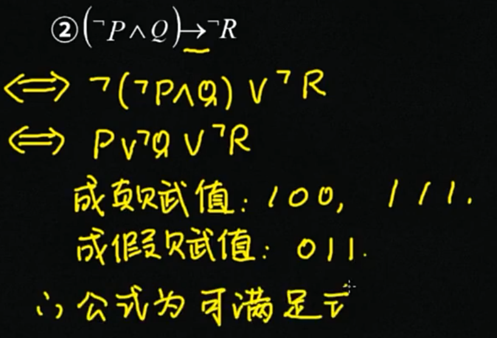
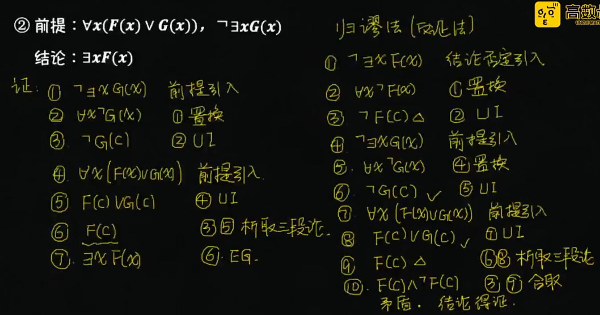
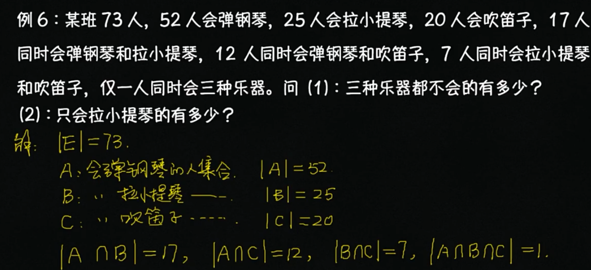
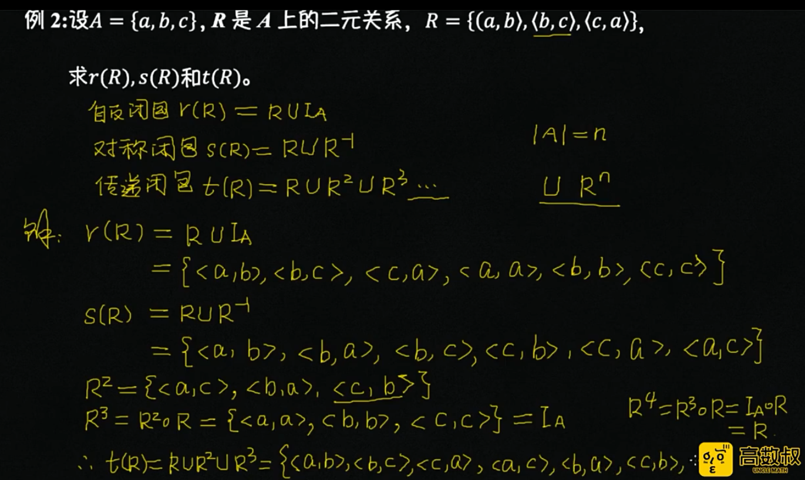
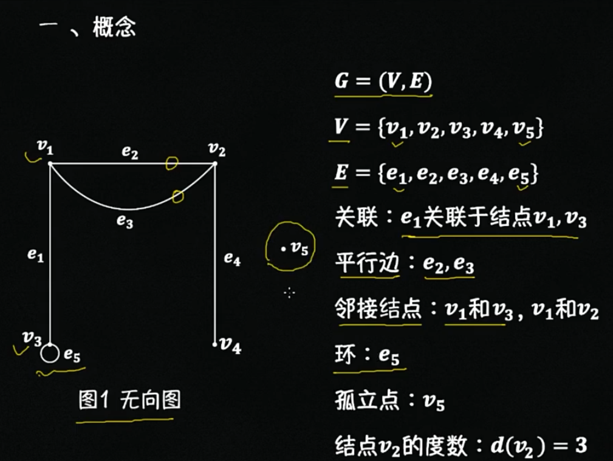
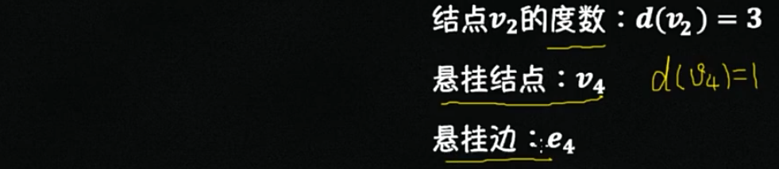
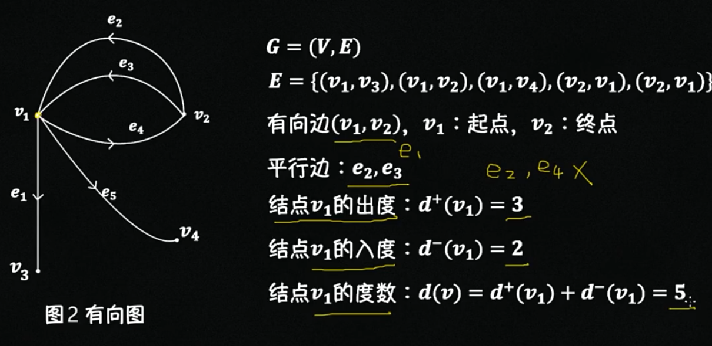
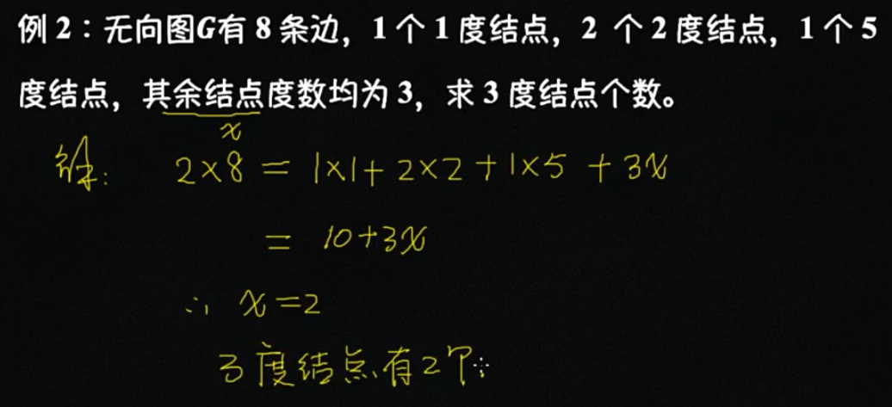
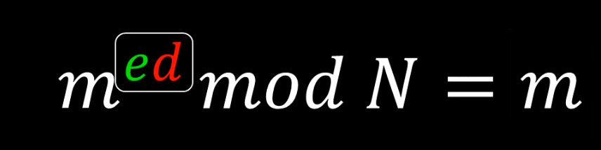

# 概念及定义

`驻点 стационарная точка` - 驻点就是这样的点, 函数在该处的偏微分全部为0，使用雅阁比矩阵的特征值可以衡量

`分岔` - 分岔就是从稳定过渡到不稳定的临界点。**分岔**（bifurcation）常出现在[动态系统](https://baike.baidu.com/item/动态系统)的数学研究中，是指系统参数（分岔参数）小而连续的变化，结果造成系统本质或是[拓扑结构](https://baike.baidu.com/item/拓扑结构)的突然改变。分岔会出现在连续系统（以常微分方程、时滞微分方程或偏微分方程来描述）或是离散系统中 （以映射来描述）。在几何观里面，**一个事物的状态，是相空间中的一个点，一个事物的变化，是相空间中点的移动，一个事物的变化过程过程，是相空间中的一条曲线。** 【简单定义】**分岔就是系统参数的变化引起了相空间的拓扑结构的变化，而此时参数点就叫做分岔点**。

`稳定性` - **对于一个动力系统的定态，对它施加一个微小的扰动，系统对这个扰动的响应为△(t)，如果我们有随着时间的**

`稳定` - 稳定就是对误差不敏感

`不稳定` - 不稳定就是对微小扰动高度敏感

`混沌 chaos` - 微分方程的解对初值非常敏感

---

`微分方程` - 知道自变量、未知函数及函数的导数（或微分）组成的关系式，得到的便是微分方程，通过求解微分方程求出未知函数。微分方程模型的特点是反应客观现实世界中量与量的变化关系，往往与时间有关，是一个动态的系统。**一个系统某一时刻状态变化率，（在边界条件确定的情况下）是由此时它的状态唯一确定的。**

`实值微分方程` - 自变量、未知函数均为实值的微分方程称为实值微分方程

`复值微分方程` - 未知函数取复值或自变量及未知函数均取复值时称为复值微分方程

`常微分方程 Обыкновенное дифференциальное уравнение` - 自变量只有**一个**的微分方程称为常微分方程

`偏微分方程 Дифференциальное уравнение в частных производных` - 自变量的个数为**两个或两个以上**的微分方程称为偏微分方程

`阶数` - 微分方程中出现的未知函数最高阶倒数的阶数称为微分方程的阶数

`通解` -  我们把含有n个独立的任意常数c1, c2, c3 ..., cn 的解称为n阶方程的通解

`解对常数的独立性` - 解对常数的独立性是指，对φ及其n-1阶偏导数关于n个常数c1, c2, c3 ..., cn的雅阁比行列式不为0

`特解` - 我们把满足初值条件的解称为微分方程的特解

`积分曲线` - 一阶微分方程 dy/dx = f(x, y) 的解y = φ(x)表示Oxy平面上的一条曲线，称为微分方程的积分曲线

`方向场/向量场` - 可以用 f(x, y)在Oxy平面某区域D上定义过各点的小线段的斜率方向，这样的区域D称为方程所定义的方向场或向量场

`等倾斜线/等倾线` - 方向场中方向相同的曲线 f(x, y) = k 称为等倾斜线/等倾线

`驻定（自治）` - 如果方程组右端不含自变量t（时间？） `dy/dt=f(y), y∈D UI R^n` 则称为驻定（自治）的

`非驻定（自治）` - 右端含t的微分方程组

`动力系统` - 动力系统有连续和离散两种状态 （P21）

`相空间` - 不含自变量、仅由未知函数组成的空间称为相空间。**一个系统的物理状态就是相空间中的一个点（相点）。物理状态的变化，就是相空间中一个相点的移动。**在几何观里面，**一个事物的状态，是相空间中的一个点，一个事物的变化，是相空间中点的移动，一个事物的变化过程过程，是相空间中的一条曲线。**

`轨线` - 积分曲线在相空间中的投影称为轨线

`奇点、平衡点、平衡解、驻定解、常数解` - 对驻定微分方程组，方程组f(y)=0的解 y=y* 表示为相空间中的点，他满足微分方程组，故称为奇点、平衡点、平衡解、驻定解、常数解

`系统的不动点` - 系统的不动点意味着系统达到了一个定常态，即系统不再随时间发生变化。

`还原论` - 一切复杂运动的规律皆可以还原至最基本组成部分的运动规律

`决定论` - 当一个事物在某一时刻状态已经确定时，我们可以预言它的一切未来轨迹

`层展` - 当然，人们还发现，与还原论相对的，如果我们只从整体来看，单个个体和少数个体的行为与群体行为之间的区别，并不是简单的加和。**通常，一个系统的尺度在从小到大的变化过程中，会表现出一种“层展”的现象，意指在个体数增加的时候，突然出现了某些在小尺度下不存在的特征。**也就是说，它会不断“涌现（emerge）”出来的小尺度范围中不曾出现的新的现象和概念。比如说，小群体的人群里面不会出现国家这个概念，但是人口数量增多之后，它却不可避免。还有，历史长河中绝大多数人的个人的行为杂乱无章，但是但是当地球上所有的人集合成为一个整体，进而形成的宏大历史，却是有着非常明晰的趋势和规律的。

`整体论` - **还原论与整体论是一体两面的，是对一个事物的两个不同角度的观察。一切大尺度涌现出来的复杂现象，其起源都是简单的底层规则。**

`系统` - 系统是什么呢？就是我们所想要研究的那个东西。比如说，我想研究一个原子的运动，那么我们就会把这个原子叫做一个系统。再比如说，我要研究一群在互相碰撞的桌球的运动，我就会把所有的这些桌球叫做一个系统。总之，系统就是我想要知道它运动状态的那个东西或那一组东西

`环境` - 物理学家通常会吧整个宇宙划分为两个部分，系统和**环境**。所有那些我们并不关心它运动状态的，它在系统之外的，对系统造成影响，是系统运动的环境，统称环境。总之，环境就是宇宙中除去“系统”剩余的部分

`边界` - 而把系统和环境分开的，叫做系统的**边界**。我们考虑边界，主要是考虑外界环境对系统的影响，也就是环境与系统的相互作用。这种相互作用，统称**边界条件**

`动力学系统\演化` - 我们常说的**动力学系统**，指的是我们关注系统的动力学特征。也就是是，一个系统的状态，在一定规则的驱动下随着时间的变化。系统状态随时间的变化，又叫做“**演化**”（evolution）

`孤立系统`  - 在科学研究学中，常用的一种系统叫做**孤立系统**。所谓孤立系统，指的是一个与外界完全隔离的系统，环境对它没有任何影响，即边界上与外界环境没有任何相互作用的系统。例如，由一个完全刚性的箱子包装的一箱气体。这个箱子完全密封、它完全隔热、同时，它屏蔽了外部所有的力的影响，那么，这箱气体就是一个孤立系统。孤立系统是一种**理想系统**，它在现实中是不存在的。我们为何要关注一种不可能存在的系统呢？因为，就像前言中所述的，所有的物理定律，全部都是在忽略了次要细节的前提下被总结出来的。理论上讲，任何一个系统，都与环境有剪不断的联系，但是当我们研究这个系统时，如果我们考虑所有这些联系，就必然会把整个宇宙牵扯进来，那么我们就什么都干不了。**孤立系统一直以来是物理研究中最有用的理想模型之一**


`决定论` - **我们可以看到，在这种类型的微分方程所描述的变化过程中，未来状态没有任何不确定性，只要现在状态已经确定了，我们就可以确定以后每一个时刻的状态，全部都是确定的：我们向历史回溯，是一条确定的轨迹，我们向未来展望，它仍然是一条确定的轨迹（未来是唯一注定的）。这就是决定论的核心**。**我们看到，决定论的演化，它的轨迹就是一条孤独的线，既不分叉，也不交叉，我们只要找到了这条线的一头，就一定能捋着它找到另一头，中间毫无其它可能性。**


# 上课问的问题

## 第一节课（2021/4/1）

1. Что такое **«стационарная точка»**, и каким уравнениям она должна удовлетворять?

   什么是“**驻点**”，驻点满足什么公式？

   - стационарная точка - Эта точка, в которых частные производные первого порядка все обращаются в нуль 	对于每个变量偏微分值为0的点
   - 依赖的公式：

   

2. Что нужно вычислить для **оценки устойчивости стационарных точек**?

   怎样衡量**驻点的稳定性**？

   - Матрица Якоби（雅阁比矩阵）, в стационарной точке, по собственным значениям этой матрицы можно судить об устойчивости 在静止点，通过该矩阵的特征值可以判断其稳定性

   

3. Что такое **«бифуркационная точка»**? Каковы простейшие виды бифуркации?

   什么是分叉点？有什么类型？

   - **Бифуркация （分叉）** – переход из устойчивого состояния в неустойчивое (или обратно).

     分叉是指从稳定状态过渡到不稳定状态（或返回）

   - **Точки бифуркации（分叉点）** – точки ветвления возможных путей эволюции системы

   - ​	分岔的类型：简单的分岔可以分为：**实分岔（вещественная бифуркация）**和 复数分岔**（комплексная бифуркация）**

   

4. Какие дополнительные уравнения необходимо написать, чтобы найти **точки поворота** и **ветвления**?

   求解**分叉点（точка бифуркации）**和**折向点（точка поворота）**需要哪些额外的条件？

   **==> 分叉行列式来自雅阁比行列式**

   - 需要求出分叉行列式的值det(J)
     - det(J)   =  0 	==> **分叉点（точка бифуркации）**
     - det(J)  !=  0 	==>  **折向点（точка поворота）**

   - Определитель матрицы Якоби системы равен нулю (分叉比行列式的值为0)

   

5. Какие дополнительные уравнения нужно написать для нахождения точек комплексной бифуркации? Как упрощаются эти уравнения для двумерной задачи, когда xR^2? Будет корень из R?

   如果要求Hopf分岔点需要什么额外的条件？怎样化简方程？

   - Вычисляем матрицу Якоби системы, ее собственные значения. Сумма собственных значений равна сумме диагональных элементов. Необходимо записать сумма диагональных элементов равно нулю. В случае двумерных отображений получаем периодическое движение по окружности = корень из эпсилона окружность и нулевую стационарную точку. По эпсилон смотрим на устойчивость.

     我们计算系统的Jacobi矩阵及其特征值。特征值之和等于对角线元素之和。需要写出对角线元素之和等于零。在二维映射的情况下，我们得到一个周期性的圆周运动=epsilon圆的根，静止点为零。由epsilon我们看的是稳定性。

   

6. Что такое **«орбитальная устойчивость» （轨道稳定性）** и в чем ее отличие о**т «устойчивости по Ляпунову»**（李雅普诺夫稳定性）?

   - **稳定性（Устойчивость ）**是由矩阵的**特征值（собственными）**决定的，如果在左半平面，那么它们是渐进稳定的，如果有一个实部为零，那么它们是稳定的。轨道稳定性取代极限周期


## 思路 

首先从初始数据中找到了模型的真实分叉点。

найдены точки (вещественной) бифуркации


根据对模型的静止点的认识，以及利用系统的雅各布确定实分叉点的方法，对系统进行了相应的分析变换。

==> 从而找到有几个分叉点


用参数导数对行列式进行类似的分析变换，以确定分叉的具体类型--转折点或分支点。

 точки поворота или ветвления（转折点或分支点）


по исходным данным были найдены точки вещественной бифуркации. На основе знаний о стационарных точках модели и способе определения точек вещественной бифуркации с помощью якобиана системы были произведены соответствующие аналитические преобразования в системе. 

Для определения конкретного типа бифуркации – точки поворота или ветвления, нужно использованы аналогичные аналитические преобразования над определителем с производными по параметрам

本文从初始数据中找到了模型的真实分叉点。根据对模型的静止点的认识，以及利用系统的雅各布确定实分叉点的方法，对系统进行了相应的分析变换。结果是两个真正的分叉点。
用参数导数对行列式进行类似的分析变换，以确定分叉的具体类型--转折点或分支点。在计算过程中，确定两点都是支点，而不是支点。

### 资料链接

```

```


# 离散数学

## 数理逻辑

### 命题逻辑

一、命题：能判断其真假的陈述句

- 命题的真值：真、假
- 真命题、假命题；简单命题（原子命题）、复合命题

例子：

- 北京时中国的首都

  （真）（T，1）

- 请关门

  (假)

- 2x + 4 >= 10

  (假) **因为命题的真值唯一**

- 我正在说假话

  (假) 悖论

## 命题联结词


​	

 ## 等值演算





 


## 命题逻辑的推理理论


## 谓词逻辑





## 几何代数


 





## 二元关系





## 图的基本概念











## 欧拉图与哈密顿图


## 树


# 公钥加密

[toc]


# 单词表

`открытый ключ` - 公钥

`Закрытый ключ` - 私钥

`` - 密钥

`Шифрование` - 加密

`Дешифрования` - 解密

`Исходные данные` - 原文

`Шифротекст` - 密文


# 加密解密的历史（引入）

在人类几千年的历史中，加密和解密的一直在相互抗衡。为了很好的说明公钥加密出现的原因，下面我就来先讲一下有史以来的几种加密方法和它对应的解密方法（破解方法）


## 第一代加密法（隐藏法）

最原始的第一代加密法说起来很简单，我们每个人都用过，就是“隐藏法”，也**就是把信息藏起来**。这种加密法，从有文字出现，一直到现在都在用。

**比如：**先把送信人的头发剃光，然后把保密消息写在那人的头皮上，等他头发长出来后，让送信人出发，到了目的地再把买发剃光，保密消息就读出来了。

**破解方法：**破解的方法就是认真搜找，纯粹的体力活


## 第二代加密法（移位法和替代法）

第二代加密法其实就是移位法和替代法，这些方法很简单

下面我来简单说一下移位法

**比如：**

- 一个数字1874，把每个数字都在数列中往后加1，那么1变2/2变3/1874就变成了2985
- 对 hello world 加密，加密规则是将每个字母往后移动两位，“hello world” 就变成了“jgnnq yqtnf”

下面我来简单说一下替代法，替代法也很好理解，就是把文中一部分字母用其他字母替代。

**比如：**

For man is man and master of his fate（人就是人，是自己命运的主人）。那如果，把其中的a都用代替，0用y代替，e用w代替，i用x代替。

就成了一段谁也看不出来的文字：

- For man is man and master of his fate
- Fyr mzn xs mzn znd mzstwr yf hxs fztw。

**破解方法：**因为英文中每个字母在文章中的出现频率不同，比如字母e是出现频率最高的，占12.7%；其次是t，9.1%；然后是a、o、i、n等，最少的是z，只占0.1%。所以破解替代法和移位法的方法是频率分析。（概率论）


## 第三代加密法（维吉尼亚密码）

这就是从这代加密法开始，加密和解密与数学扯上了关系。无论是加密还是解密，一旦用上了数学，就有意思多了。而且也是从乐意带加密法开始，“钥匙”的概念出现了。

维吉尼亚加密法也就是为了解决第二代加密法中出现的问题——字母频率不同。它是替代法的改进版，叫“多套符号加密法”。为了掩盖字母中暴露的频率特征，解决方法就是用多套符号代替原来的文字。比如原文的字母是A，从前只把它替换为F，现在可以替换为F或G这两个。从前单套符号替代的时候，凡是文字中频率为7.63％的符号，差不多就代表A了。但现在A由F和G混合在一起，7.63％的特征不再出现，哪个符号代表A就没人知道了，于是频率分析法暂时失效。

这个用了26套字符的方法，就是第三代密码“维吉尼亚加密法”。就是它，成功压制了解密一方的频率分析法。它是一个表格，第一行代表原文的字母，下面每一横行代表原文分别由哪些字母代替，每一竖列代表我们要用第几套字符来替换原文。一共26个字母，一共26套代替法，所以这个表是一个26x26的表。


第三代的维吉尼亚加密法在真实使用时，人们事先规定每个字母用了哪套移位法时，并不是毫无规律的瞎指定，而是要约定一个规则，这个规则就叫作“**钥匙**”

**比如：**

要对一个“hello”进行加密，钥匙是yes，那怎么加密呢？你看，

yes的y是第25个字母，就代表加密时把原文第一个字母往后移25位; 

yes的第二个字母e是字母表中第5个字母，就代表把原文的第二个字母往后移5位; 

yes的第三个字母s在字母表中是第19个字母，就代表把原文第3个字母后移19位。

这样原文的前三个字母，就分别用了第25套，第5套，第19套替代法。那原文第4个，第5个，第6个字母怎么解决呢？好办，就按刚刚的规则循环就好。


这样，“hello”在钥匙是yes的情况下，就被加密成了FIDJS

**破解方法：**破译维吉尼亚密码的关键在于它的密钥是循环重复的。如果我们知道了密钥的长度，那密文就可以被看作是交织在一起的[凯撒密码](https://zh.wikipedia.org/wiki/凯撒密码)（移位法），而其中每一个都可以使用频率分析单独破解。


## 第四代加密法（恩尼格玛机）

它使用的加密方式，本质上还是第二代加密法一一替代和移位，但因为可以切换无穷多种加密配套组合，所以在对抗频率分析法上极其有效。

也正是从它开始，密码学不再依赖纸和笔的运算，使用**机械和电子加密的时代正式到来**，所以它是第四代加密法。

得益于恩尼格玛机里面有许多机械的齿轮，恩尼格玛机的真正高明之处在于每敲一个字母，齿轮会往下转一格，齿轮的转动导致线路连接的变化，而连接线一变，又直接导致加密结果的不同。所以同一个字母敲入第二次，第三次，输出到密文显示板的结果也都不一样。总之，齿轮能转多少格，就意味着有几套加密法等着轮替。

**破解方法：**人性的弱点


## 第五代加密法（对称加密系统）

从第五代加密法，也就是70年代出现的魔王加密系统（Lucifer）开始，密码学就出现了分水岭。因为计算机的出现，让加密解密的最小单位从字母变成了数字，数字的变化打乱了信息的底层结构。二进制的0和1，让密码的复杂度一下就上升了不知道多心个数量级。

**缺点/破解方法：**是对称加密，加密和解密的钥匙一样，有时无法保证钥匙的安全


# 第六代加密法（RSA加密系统）【重点讲解的】

一直到上个世纪的70年代，人们都还在使用对称加密算法。也就是说，信息的收发方会通过事先商定好的密钥对数据进行加密和解密。然而这种加密方式有诸多缺陷，随着网络规模的不断增大，每多一个用户就需要保存许多额外的密钥，密钥的管理也将逐渐成为所有人的负担，更加致命的是密钥必须通过见面协商，而没有办法直接通过网络进行交换，因为密钥的传输过程需要进行加密，而没有密钥则不能进行加密。

那有没有一种可能性？我们用不同的密钥对数据进行加密和解密，其中对数据加密的密钥是对所有人公开的，而对数据解密的密钥仅为接受者持有呢。**这就好比一个公开的邮箱，投递口是任何人都可以寄信进去的，这可视为公钥；而只有信箱主人拥有钥匙可以打开信箱，这就视为私钥。**所以70年代末，第六代的RSA加密系统出现了，它解决了钥匙递送中的漏洞，可靠性大幅提升。虽然**它并不是无法破解，但因为计算量太大，在理论上破解时间无限长**。

所以，加密时所用的数学工具，决定了一个密码能否被破译。


## 加密过程的简单说明

在数学上，$d(c(x))=x$ 假设来解释：

1. 爱丽丝与鲍伯事先互不认识，也没有可靠安全的沟通渠道，但爱丽丝现在却要透过不安全的互联网向鲍伯发送信息
2. 爱丽丝撰写好原文，原文在未加密的状态下称之为明文 $x$
3. 鲍伯使用[密码学安全伪随机数生成器](https://zh.wikipedia.org/wiki/密码学安全伪随机数生成器)产生一对密钥，其中一个作为公钥为$c$，另一个作为私钥 $d$ 
4. 鲍伯可以用任何方法传送公钥 $c$ 给爱丽丝，即使伊夫在中间窃听到 $c$ 也没问题
5. 爱丽丝用公钥 $c$ 把明文 $x$ 进行加密，得到密文 $c(x)$ 
6. 爱丽丝可以用任何方法传输密文 $c(x)$ 给鲍勃，即使伊夫在中间窃听到密文 $c(x)$ 也没问题
7. 鲍伯收到密文，用私钥 $d$ 对密文进行解密 $d(c(x))$，得到爱丽丝撰写的明文 $x$ 
8. 由于伊夫没有得到鲍伯的私钥 $d$ ，所以无法得知明文 $x$
9. 如果爱丽丝遗失了她自己撰写的原文 $x$，在没有得到鲍勃的私钥 $d$ 的情况下，她的处境将等同伊夫，即无法透过鲍伯的公钥 $c$ 和密文 $c(x)$ 重新得到原文 $x$

---

## 加密过程的详细说明


在公钥加密算法中，由于公钥是对所有人公开的信息，我们需要保证数据被公钥加密之后，不能够被轻易的反推出来。那什么样的算法，单向计算容易而逆向反推却非常难呢？

## 模运算


答案是模运算（Modular Arithmetic），模运算又被叫做求余运算。像计算机中的伪随机数、散列算法都是他的典型应用，试想下面这个例子：

- $3^3 mod 7 = 6$

  要计算三的三次方对取数很容易，答案是6

- $3^x mod 7 = 6$

  但已知答案是6的情况下，我们又应如何去寻找这里的x值呢？


由于求余算法并不可逆，我们只能一个一个数的带进去试，但如果这里出现的是很大很大的数（$3^x mod 98442628970361896465446546824 = 6$），再去一一尝试就很不现实了。这也是为什么模运算被称作是单向函数。因为对于大数来说，对模运算求逆是根本不现实的。而公钥加密正是利用了模运算的这个特性。


这是一个简单地加密：假设我们将原始数据表示成一个数 m（==m==essage），然后我们对它求 e 次幂（==e==ncrypt），这里的 e 可以看作是我们加密时使用的密钥，然后我们将结果除以 N 并取余数，最后得到密文 c （==c==ipher）。


并且根据我们之前讲到的，正向计算出这里的密文很简单，但反向推出这里的原始数据却很难。


解密的过程与之非常类似，我们需要对密文 c 求 d 次幂，这里的 d（==d==ecrypt）代表另外一个用于解密的密钥，最后得到的结果是解密后的原始数据 m。




接下来为了理解的方便，我们将两个公式做一些变换，合并成一个更简洁的形式。可以发现，如何选取这里的 e 和 d 便成了公钥加密中最关键的问题。


为此我们就不得不提到欧拉在1763年的一个重要发现——欧拉定理。欧拉定理表示，对于任何一个能与 n 互质的正整数 m，取它的 φ(n) 次方，并除以 n 区余数，结果都永远等于一。


这里的  φ(n) 是欧拉函数，它代表在小于或等于 n 的正整数中，有多少个与 n 互质的数。


例如：这里我们取 n = 6，我们会发现在小于等于 6 的正整数中只有 1 和 5 和数值互为质数（也就是说它们除了 1 以外并不存在其他的公约数），所以  φ(6) =2 

在了解 φ 函数之后，我们回到欧拉定理，尝试着对公式进行一些简单的变换。

$m^{φ(n)}≡1(mod\ n)$


首先我们可以在等式两端同时取 k 次幂（k 在这里代表任意的正整数）

$(m^{φ(n)})^k≡1^k(mod\ n)$

$m^{kφ(n)}≡1(mod\ n)$


接着我们在两端同时乘以 m，并化简为这样的形式，

$m^{kφ(n)}*m≡1*m(mod\ n)$

$m^{kφ(n)+1}≡m(mod\ n)$


之后我们将模运算写在等式的左遍，就变成了这样

$m^{kφ(n)+1}mod\ n≡m$


如果我们将这个公式和之前讲到的加密解密公式对应起来，会发现这里的指数部分是相同的

- $m^{ed}mod\ n≡m$

- $m^{kφ(n)+1}mod\ n≡m$


于是我们可以把 d 和 e 的关系表示成这样的形式

$de=kφ(n)+1$

$d=\frac{kφ(n)+1}{e}$


也就是说，我们可以通过选取这里的 k n e，来计算出用于解密的密钥 d。这个公式看起来非常简单，但这里面 φ(n) 的计算并没有想象中的那么容易。而 **φ(n)**  的计算也恰恰是公钥加密中最关键的部分。实际上，要计算出 φ(n) 的唯一办法是对这个数 n 做质因数分解，比如：

$8=2*2*2$

$27=3*3*3$

$11445=3*5*7*109$

然而大数的质因数分解本身是非常困难的事情。截至目前为止，用最前沿的分布式算法，大约花了2700个“CPU年”才成功分解了一个829位的数字。因此对于大数来说， φ(n) 的求解可以看作是计算上不可行的（computational infeasible）。


但是，如果 n 本身就是一个质数，情况就有所不同了。比如对于质数7来说，小于等于7并与7互质的数有1~6，除了7本身。因此 φ(7) 等于 6。


同理对于质数13来说，与13互质的数，除了13本身其他的全部都是。因此 φ(13) 等于 12。


其实对于任何质数 p，我们都可以推广到 φ(p) 等于这个质数 p 减去 1

$ φ(p) =p-1$

除此之外，φ 函数还有一个重要的特性，对于两个互质的整数 p 和 q，$ φ(p*q)$ 可以直接拆分为 $ φ(p)$ 和 $ φ(q)$它们单独的乘积。

$ φ(p*q) = φ(p)*φ(q)$


例如，我们可以选取两个质数 17 和 23，由于

$ φ(17*23) = φ(17)*φ(23) = 16*22=352$

因此我们可以轻易的求得 

$φ(391) = 352$


我们带入之前推导出的公式  $d=\frac{kφ(n)+1}{e}$  ，然后选取一个较小的数 $e=3$，这里我们需要保证它与  φ(n) **互质**，于是在 k 等于 5 的情况下，求得用于解密的密钥 d 等于 587，在求出了私钥 d 以后，我们将不再需要这里的 p 和 q 了，算法会将 e 和 n 公布，作为加密时用的公钥（public key），而 d 将会被保存下来作为解密时用的私钥（private key）。其他人由于不知道 p 和 q 这两个关键的质因数，没有办法计算出这里的  φ(n) ，因而无从破译这里的私钥 d。

公钥加密正是利用了这个信息不对等，让加密者能够快速构造出一个 φ(n) ，而其他人却无法在有限的时间内求解它。


接着我们用求得的 e d n 来模拟一段信息的加密解密过程。我们要加密的字符是 “a”，它所对应的ASCII编码是97，于是97 的3次方除以931并取余数等于79，此时79就是我们加密后的密文。

为了解密，我们计算79的587次方除以391取余数，得到原始数据97，因此成功还原了字符 “a”。

---


以上讲到的便是公钥加密算法的全部工作原理，这个算法在首次被发现之后就被政府作为机密尘封起来，后来又在1977年被三个麻省理工的数学家独立发掘，称为当下众所周知的 RSA 加密算法，这个算法的名字正是以他们三人姓氏的首字母命名，RSA 绝对是当今应用最为广泛的公钥加密算法，像数字签名、数字证书、SSH、HTTPS 的加密连接全部是它的典型应用。在实际使用中，由于公钥加密的计算量大、速度慢，通常它会和对称加密算法一同使用，公钥加密算法常被用作最初连接的建立，而真正数据传输的过程会交由对称加密算法来处理。

以上便是公钥加密算法的全部奥秘，一对看似无关的数字却连接着探索真相的答案，一个看似简单的算法却暗藏着千年未解决的数学难题，这可能便是计算机与数学之间最美妙的邂逅吧

+ 破解？


## 第七代加密法（量子加密）【如果老师问的话，可以说下？】

第七代加密法是量子加密，它背后的理论支撑是测不准原理和特殊的算法。因为当前因为技术水平不够，只能对长度比较短的钥匙加密，而不能对整个信息加密。据说在一些国家的高级保密单位已经开始使用。它从物理学和数学原理上是不可破解的，是最强的加密法。


